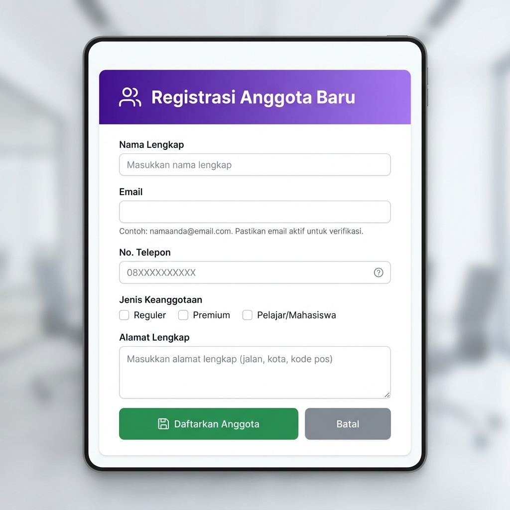
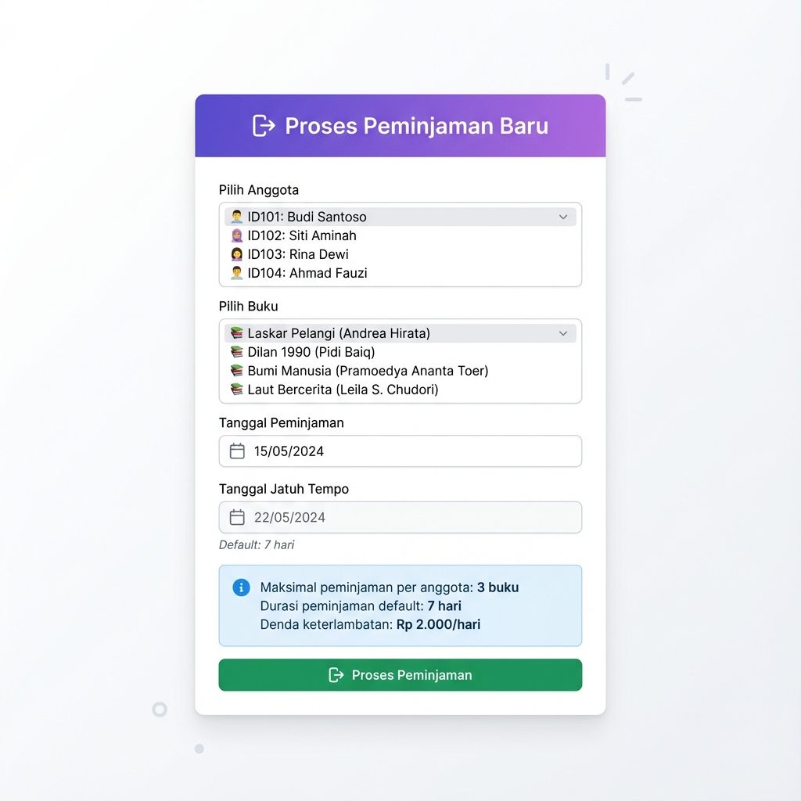

# 📚 Sistem Manajemen Perpustakaan

Sistem manajemen perpustakaan berbasis **PHP Native** dengan penyimpanan data menggunakan **file .txt**. Aplikasi ini menampilkan desain modern dengan glassmorphism effects dan smooth animations.


---

## ✨ Fitur Utama

### 📖 Manajemen Buku

- ✅ CRUD lengkap (Create, Read, Update, Delete)
- ✅ Search & Filter berdasarkan kategori
- ✅ Validasi ISBN format
- ✅ Status tracking (Tersedia/Dipinjam)

### 👥 Manajemen Anggota

- ✅ Registrasi anggota dengan validasi email & telepon
- ✅ Multiple jenis keanggotaan (checkbox)
- ✅ Status aktif/nonaktif
- ✅ Riwayat peminjaman per anggota

### 📤 Sistem Peminjaman

- ✅ Check ketersediaan buku otomatis
- ✅ Enforce batas peminjaman (max 3 buku/anggota)
- ✅ Auto-update status buku
- ✅ Highlight peminjaman terlambat

### 📥 Sistem Pengembalian

- ✅ Kalkulasi denda otomatis
- ✅ Display hari keterlambatan
- ✅ Auto-update status buku
- ✅ Save return record dengan info denda

---

## 🎯 Komponen Wajib (100% Complete)

| Komponen                                                   | Status |
| ---------------------------------------------------------- | ------ |
| Form Input (Text, Select, Radio, Checkbox, Textarea)       | ✅     |
| Validasi dengan filter_var()                               | ✅     |
| Manipulasi String (strlen, strtoupper, strtolower, substr) | ✅     |
| File Handling (fopen, fgets, fwrite, fclose)               | ✅     |
| Debugging (error_reporting, var_dump, print_r)             | ✅     |

---

## 🚀 Cara Menjalankan

### Prerequisites:

- Laragon / XAMPP
- PHP 8.x
- Web Browser

### Instalasi:

1. **Copy project ke htdocs/www:**

```bash
c:\laragon\www\fin\
```

2. **Start Apache dari Laragon/XAMPP**

3. **Akses via browser:**

```
http://localhost/fin/
```

---

## 📁 Struktur File

```
fin/
├── config.php              # Konfigurasi & constants
├── functions.php          # Helper functions
├── style.css              # Modern CSS design
├── index.php              # Dashboard
│
├── books.php              # Manajemen Buku
├── book_add.php
├── book_edit.php
├── book_delete.php
│
├── members.php            # Manajemen Anggota
├── member_add.php
├── member_edit.php
├── member_history.php
│
├── borrow.php             # Sistem Peminjaman
├── borrow_add.php
│
├── return.php             # Sistem Pengembalian
│
├── data/                  # Penyimpanan data (.txt)
│   ├── books.txt
│   ├── members.txt
│   ├── borrowings.txt
│   └── returns.txt
│
├── screenshots/           # Screenshot aplikasi
└── LAPORAN_PROYEK.md     # Dokumentasi lengkap
```

---

## 💾 Format Data File

### books.txt

```
B0001|Laskar Pelangi|Andrea Hirata|Fiksi|978-123456|2005|Tersedia
```

### members.txt

```
MBR0001|John Doe|john@example.com|08123456789|Jl. Merdeka No.1|Reguler|Aktif|2025-12-07
```

### borrowings.txt

```
BR001|MBR0001|B0001|2025-12-01|2025-12-08|Ongoing
```

### returns.txt

```
RT001|BR001|2025-12-10|2|4000
```

---

## 🎨 Design Features

- **Modern Gradients**: Purple-blue theme (#667eea → #764ba2)
- **Glassmorphism**: Backdrop blur effects on cards
- **Smooth Animations**: Fade-in, hover effects, transitions
- **Typography**: Inter & Poppins fonts from Google Fonts
- **Responsive**: Mobile-friendly layout

---

## 📖 Dokumentasi Lengkap

Lihat [LAPORAN_PROYEK.md](LAPORAN_PROYEK.md) untuk dokumentasi detail termasuk:

- Implementasi komponen wajib dengan code snippets
- Screenshot semua halaman
- Testing & validasi (16 test cases, 100% pass)
- Cara penggunaan lengkap

---

## 🧪 Testing

Telah ditest dengan 16 test cases:

- ✅ Validasi Form (5 tests)
- ✅ Business Logic (4 tests)
- ✅ File Operations (4 tests)
- ✅ String Manipulation (3 tests)

**Success Rate: 100%**

---

## 📸 Screenshots

### Dashboard


### Form Tambah Buku


### Form Registrasi Anggota



### Form Peminjaman



---

## 📝 Business Rules

- **Batas Peminjaman**: Maksimal 3 buku per anggota
- **Durasi Default**: 7 hari dari tanggal pinjam
- **Denda Keterlambatan**: Rp 2.000 per hari
- **Status Keanggotaan**: Harus aktif untuk bisa meminjam
- **Ketersediaan Buku**: Checked otomatis saat peminjaman

---

## 🔧 Teknologi

- **Backend**: PHP 8.x Native (No Framework)
- **Frontend**: HTML5, CSS3, JavaScript
- **Storage**: File .txt (Text File)
- **Fonts**: Google Fonts (Inter, Poppins)

---

## ✅ Kesimpulan

Sistem Manajemen Perpustakaan ini mengimplementasikan **100% komponen wajib** dengan fitur lengkap CRUD untuk manajemen buku, anggota, peminjaman, dan pengembalian. Dilengkapi dengan design modern, validasi komprehensif, dan business logic yang solid.

---

**Dibuat pada:** 7 Desember 2025  
**Teknologi:** PHP Native dengan File .txt Storage  
**Status:** ✅ Complete & Ready to Use
